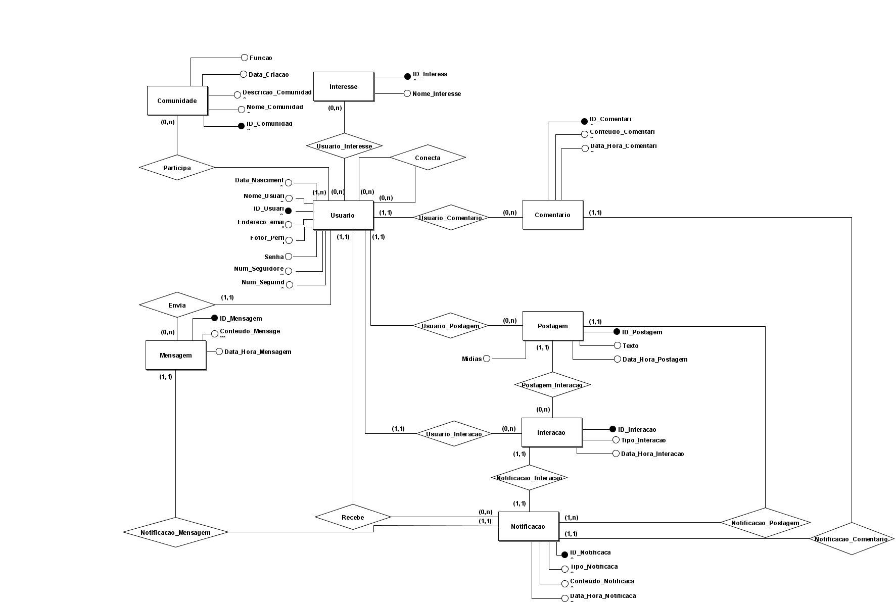
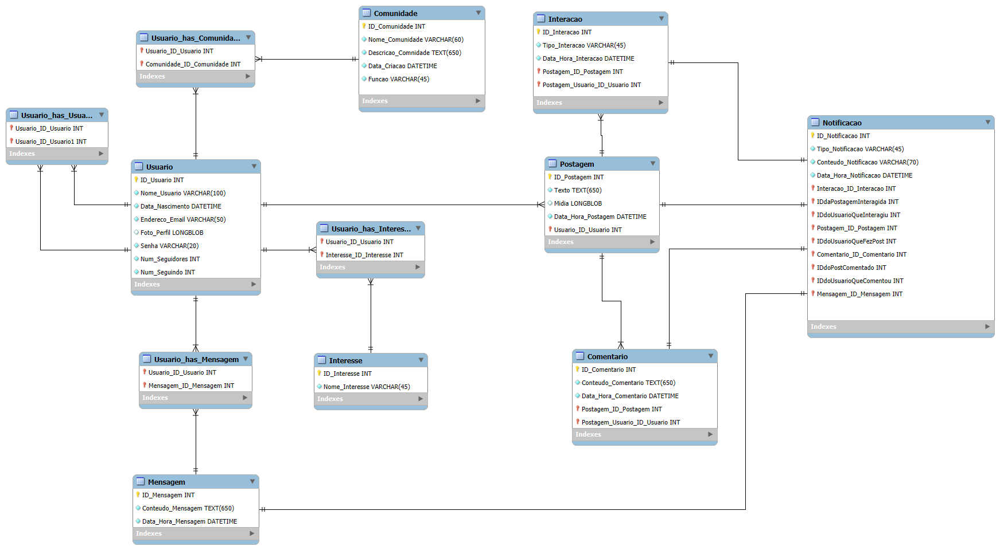

# 🌐 **Rede Social - Laboratório de Banco de Dados**  

🎓 Este projeto reúne o levantamento de requisitos e a modelagem de dados de uma rede social, desenvolvido para a conclusão da disciplina de **Laboratório de Banco de Dados**. 🚀  

---

## 🛠️ **Funcionalidades Principais**  

1. **Cadastro de Usuários** 👤  
   - Registro com validação de dados.  

2. **Postagens** 📝  
   - Criação de postagens com texto, mídia e interações como curtidas e comentários.  

3. **Grupos e Comunidades** 👥  
   - Criação e gerenciamento de grupos temáticos e associação de usuários.  

4. **Mensagens Privadas** 💬  
   - Envio e armazenamento de mensagens entre usuários.  

5. **Notificações** 🔔  
   - Alertas para interações relevantes.  

---

## 🧩 **Modelagem de Dados**  

📊 A modelagem foi cuidadosamente planejada para garantir a integridade e eficiência do banco de dados.  

- **Principais Entidades**:  
  - **Usuário**  
  - **Postagem**  
  - **Comentário**  
  - **Grupo**  
  - **Mensagem**  

- **Relacionamentos**: Bem definidos para assegurar a consistência dos dados.  

---

## 💾 **Estrutura do Banco de Dados**  

- **Tecnologia**: MySQL  
- **Etapas do Modelo**: Conceitual, lógico e físico  

---

## 📑 **Diagramas**  

### 📜 Modelo Conceitual  
  

### 📜 Modelo Lógico  
  

---

## 📜 **Scripts SQL**  

🔗 Confira os scripts detalhados para criar e manipular o banco de dados no arquivo:  
👉 [**Documentação dos Scripts**](./src/Scripts/Readme.md)  